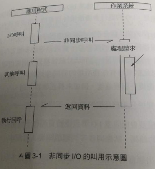

# IO & 運算
* 通常可平行運作
* 同步 IO 會導致 CPU 等待 IO 完成
* OS Kernel 只有 Blocking/Non Blocking IO 
     * Blocking IO 會等到 Kernel 完成所有操作才會返回
     * Non Blocking IO 會於呼叫後立即返回一個操作碼, 而不會等待操作完成
        * Polling : 使用操作碼詢問狀態
            * read : 持續詢問是否有資料可讀取
            * select: 使用事件狀態判斷是否有資料可讀取, 但有 1024 個事件限制
            * poll : 解決 select 限制 1024 個事件
            * epoll : Linux 下實現, 內核檢測是否有 IO事件, 如果有則通知, 沒有則休眠, 不會浪費 CPU 進行倫巡
            * kqueue : FreeBSD 下實現, 類似 epoll
            


# 非同步 IO
* *nix: libeio 使用 Threading Pool + Blocking IO 模擬
* windows: iocp, 內部還是用 Threading Pool 實現
* libuv 抽象化 windows 和 *nix 的非同步 IO 呼叫




# Node 執行模型-事件迴圈
* 每執行一次迴圈過程稱為 Tick
* 


# setTimeout/setInterval/process.nextTick/setImmediate
* setTimeout/setInterval 不精準
* 要非同步立即執行一個操作建議使用 process.nextTick

## process.nextTick vs setImmediate
* process.nextTick
    * idle 觀察者
* setImmediate
    * check 觀察者
* 事件迴圈觀察者檢查順序 : idle > io > check

```
console.log(process.versions.node);
process.nextTick(function(){
    console.log('tick #1');
});
process.nextTick(function(){
    console.log('tick #2');
});

setImmediate(function(){
    console.log('setImmediate #1');
    
    process.nextTick(function(){
        console.log('tick #3');
    });
});

setImmediate(function(){
    console.log('setImmediate #2');
});

result:
6.2.1
tick #1
tick #2
setImmediate #1
setImmediate #2
tick #3
```

# Server 模型
* 同步 : 每次只能處理一個請求, 其餘請求等待
* 每個請求一個 Process: 可處理多請求, 但系統資訊有限, 不具可擴展性
* 每個請求一個 Thread: 每個請求耗用資源比 Process 低, 大量並發請求仍有瓶頸
* 事件驅動: 每個請求是一個非同步 IO 
    * nginx
    * ruby - event machine
    * perl - Any Event
    * python - twisted
    * Lua - luavit